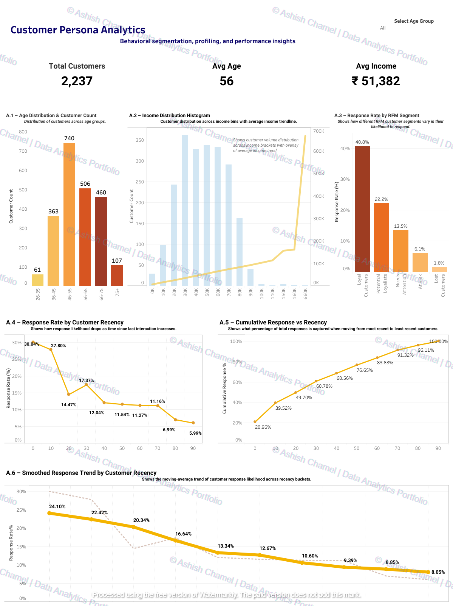
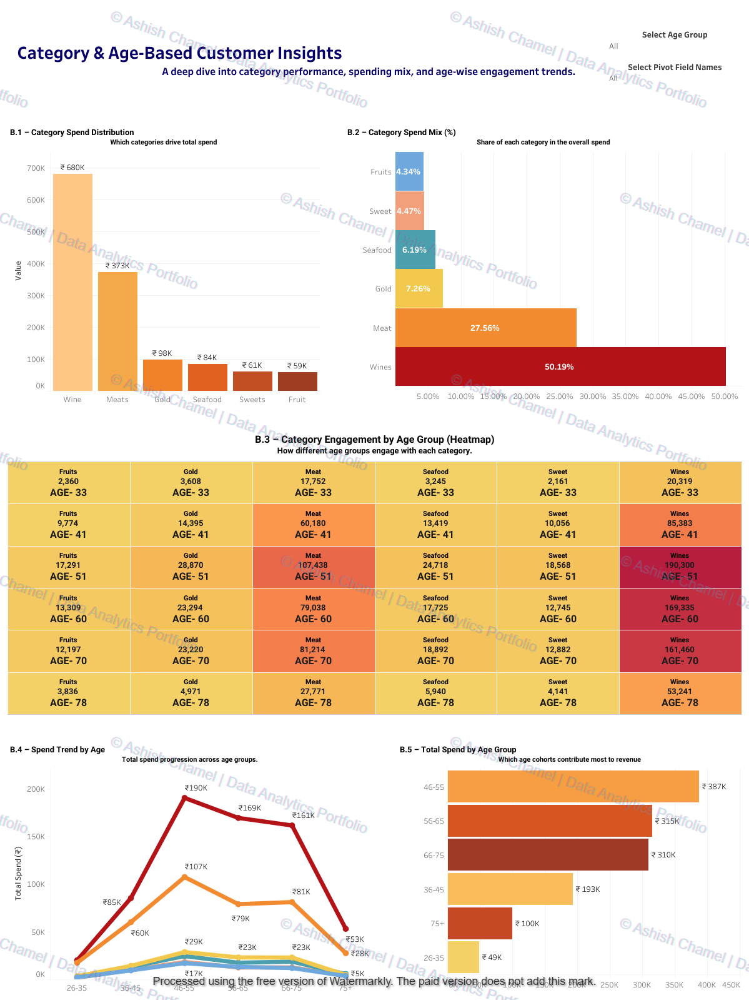
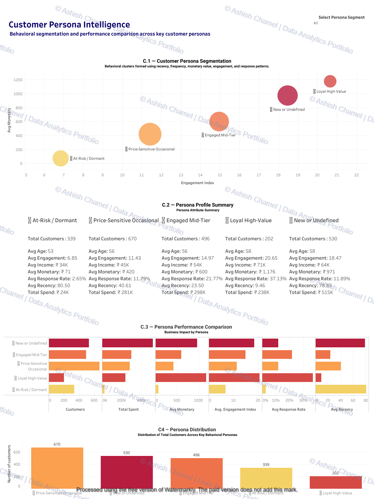

# Customer Persona Analytics

End-to-end retail customer analytics project focused on behavioral segmentation, RFM modeling, and revenue optimization using Excel, SQL, Python, and Tableau.

This project transforms raw retail marketing data into actionable customer intelligence dashboards to support targeting, retention, and premium product strategy.

---

## Executive Summary

The project analyzes 2,237 customers and identifies high-value, at-risk, and engagement-driven segments using Recency, Frequency, and Monetary modeling.

Key metrics:

- Total Customers: 2,237  
- Average Age: 56  
- Average Income: ₹51,382  
- Primary Revenue Driver: Wines (50.19% of total spend)  
- Highest Revenue Age Group: 46–55  

The analysis reveals that middle-aged, educated, mid-to-high income customers drive premium category sales and demonstrate higher campaign responsiveness.

---

## Project Objectives

- Segment customers using RFM methodology  
- Identify high-value and churn-risk groups  
- Analyze category-level revenue drivers  
- Study demographic impact on campaign response  
- Build executive dashboards for business decision-making  

---

## Analytics Workflow

### 1. Data Cleaning (Excel)

- Removed duplicates and invalid records  
- Created Age and Total Spend fields  
- Validated income and demographic distributions  

### 2. SQL Exploration

- Created structured retail schema  
- Verified data integrity (no missing/duplicate records)  
- Generated income tiers and response rate queries  
- Built RFM scoring logic using NTILE()  

### 3. Python EDA & Feature Engineering

- Built total_spent, frequency, family_size features  
- Performed correlation analysis (income vs spend)  
- Conducted statistical testing (income vs response)  
- Implemented quantile-based RFM scoring  
- Exported Tableau-ready dataset  

### 4. Tableau Dashboard Development

- Built persona segmentation dashboards  
- Designed revenue contribution visualizations  
- Created engagement and recency response models  
- Delivered business-ready interactive reporting  

---

## Key Business Insights

### Revenue Drivers

Category Spend Distribution:

- Wines: ₹680K (50.19%)  
- Meat: ₹373K (27.56%)  
- Gold: ₹98K (7.26%)  
- Seafood: ₹84K (6.19%)  
- Sweets: ₹61K (4.47%)  
- Fruits: ₹59K (4.34%)  

Wines alone account for half of total revenue, indicating strong premium consumption patterns.

---

### Age-Based Revenue Contribution

Top Revenue Cohorts:

- 46–55 → ₹387K  
- 56–65 → ₹315K  
- 66–75 → ₹310K  

The 46–60 segment is the strongest commercial driver.

---

### RFM Segmentation Distribution

- Price-Sensitive Occasional → 670 customers  
- New / Undefined → 530 customers  
- Engaged Mid-Tier → 496 customers  
- At-Risk / Dormant → 339 customers  
- Loyal High-Value → 202 customers  

Loyal High-Value customers show:

- Avg Income: ₹71K  
- Avg Engagement Index: 20.65  
- Avg Response Rate: 37.13%  
- Avg Recency: 9.46 days  

This segment is highly responsive and commercially critical.

---

### Recency & Response Behavior

- Response rate declines steadily as recency increases.  
- Most recent customers show ~30% response probability.  
- Customers inactive for 90+ days drop below 8%.  

Reactivation campaigns should prioritize the 30–60 day window.

---

### Income & Spending Relationship

There is a moderate positive correlation between income and total spending.

Higher income customers disproportionately contribute to premium categories such as Wine and Meat.

---

## Dashboards

### 1. Customer Persona Analytics



### 2. Category & Age-Based Customer Insights



### 3. Customer Persona Intelligence



---

## Tech Stack

- Excel – Data Cleaning and Preparation  
- MySQL – Querying and RFM Modeling  
- Python (pandas, numpy, seaborn, matplotlib) – EDA and Feature Engineering  
- Tableau – Dashboard Visualization  
- GitHub – Documentation and Version Control  

---

## Repository Structure
```
customer-persona-analytics/
│
├── docs/
│   ├── images/
│   └── report/
│
├── sql/
│   └── retail_persona_analysis.sql
│
├── python/
│   └── retail_persona_analysis.ipynb
│
└── README.md
```
Dataset is not included due to size and distribution constraints.

---

## Strategic Implications

- Focus premium marketing on 46–60 age group  
- Prioritize Loyal High-Value and Engaged Mid-Tier segments  
- Launch reactivation campaigns for 30–60 day inactive customers  
- Promote wine-centric bundles to mid-to-high income customers  
- Improve retention funnel for New/Undefined segment  

---

## Tableau Public

Interactive dashboards:

https://public.tableau.com/app/profile/ashish.chamel

---

## Author

Ashish Chamel  
Data Analytics | SQL | Python | Tableau  

LinkedIn: https://www.linkedin.com/in/ashish-chamel

---

This project demonstrates a complete analytics pipeline from raw customer data to actionable business intelligence using structured querying, statistical validation, and interactive visualization.
